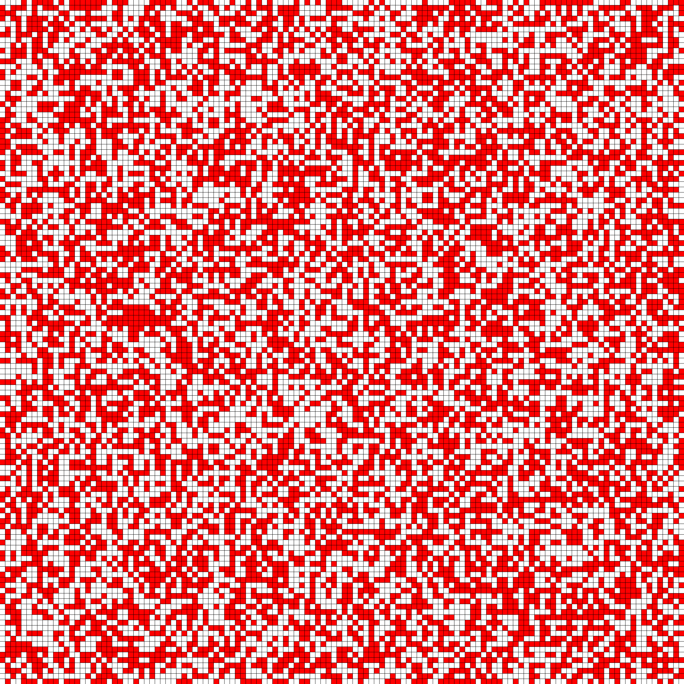

# GameOfLife
Game of Life implementation in Rust.

This is my first program in Rust.

# Controls

- Escape, Q or window "x" > Quit.
- Space > Toggle autostep.
- S > Step game.
- 1 > Empty grid.
- 2 > Random grid.
- 3 > Glider gun example.
- Left mouse button > Set a cell alive.
- Right mouse button > Set a cell dead.

# Features

- Random grid generation.
- Load from file.
- FPS limiter, to ensure consistent framerate across devices.
- Keyboard control.
- Click or hold left mouse button to set cells to alive.
- Click or hold right mouse button to set cells to alive.
- Autostep and manual step of the game.
